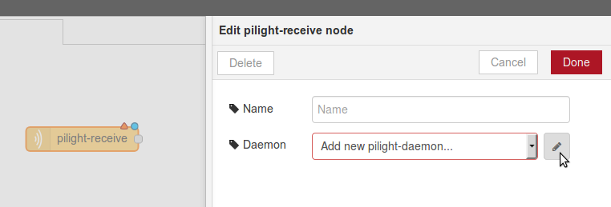
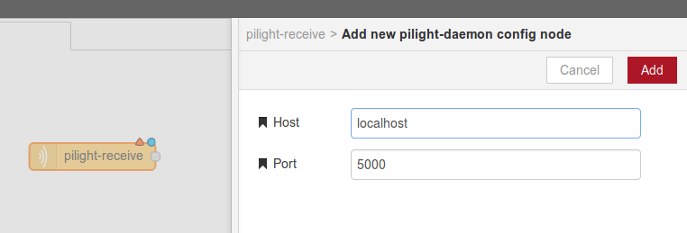

# pilight bridge for Node-RED

Basic [Node-RED](https://nodered.org) nodes to receive configuration updates from [pilight](https://www.pilight.org/).

## Configure pilight

This pilight bridge is tested to work with pilight 7.0. First a configuration of pilight is needed to be able to communicate with its daemon. First set a fixed port in the settings section of the pilight configuration file `config.json`:

```
"settings": {
   "port": 5000,
   ...
}
```

Then add your devices (RF switches etc.) to the device section of the config file ([more info](http://manual.pilight.org/configuration/devices.html)). pilight will send configuration updates via its API for these devices.

## Setup

Todo

## Usage

Right now there is one node: `pilight-receive`, which can be found in the input section of the palette in Node-RED. Its purpose it to receive configuration updates for devices defined in pilight. Every time a device changes its state (i.e. a switch was turned off) the pilight-receive node will receive an event for that.

If you want to use one or more `pilight-receive` nodes, just drag the node from the palette. The first thing to do is to define the host and port of pilight. Just double click on the node and add a new pilight daemon as shown below.





After you deployed your flow, you should be connected to the pilight-daemon. You can check the logs in a terminal and should see something like `[pilight-receive:xxxxxxx.xxxxx] socket connection: success`.

You can connect a debug node to the pilight-receive node to check what is received from pilight. The events should look similar to this:

```javascript
{
  origin: "update",
  type: 1,
  uuid: "0000-00-00-00-000000",
  devices: {
    0: "mySwitch"
  },
  values: {
    timestamp: 1509835595,
    state: "on"
  }
}

```

You can add filters and functions in Node-RED to react on specific devices and states.

## License

This project is licensed under the MIT License - sees [LICENSE.md](LICENSE.md) file for details